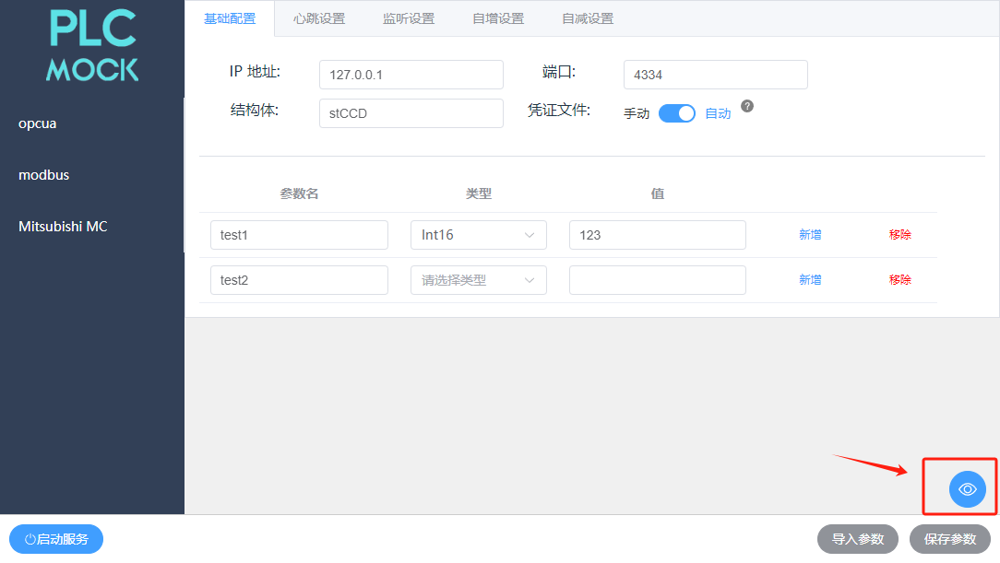

# kl-mockplc
模拟plc服务器的程序，可以自定义plc的结构体、变量。<br>兼容`opcua`、`modbus`、`三菱MC`、`kl-TCP(待实现)`等协议<br>并且实现设置变量的 `心跳`、`监听值并作出反馈`、`自增`、`自减`功能<br>启动服务后能够实时监控和修改所有变量的值

https://github.com/muyikk/plcMock-software
### 一、服务名称
plc模拟程序v1.2.0
	
### 二、使用方式
1.编辑基础设置（ip、端口等）<br>
2.设置参数列表<br>
3.设置参数特性，如：心跳、监听、自增、自减 （可选）<br>
4.config文件默认保存在`软件根目录/config/`里
#### 心跳设置

<br>心跳将会在`值1`和`值2`之间以`间隔时间`反复变化
#### 监听设置

<br>当监听到`参数名`的值变成`参数值`时，`被改变的参数名`的值会变为`被改变的值`
#### 自增设置

<br>`参数名`的值会以`自增公差`，以`时间间隔`进行递增
#### 自减设置
同***自增设置***
#### 实时监控

### 三、编辑config文件（可选）
在config文件夹中，有三个预设config，对应opcua、modbus、三菱，可自行更改

### Question
#### 1、如果缺少凭证文件`privateKey.pem`和`certificate.pem`，会提示报错<br>可以选择执行重新生成自签名证书和私钥<br>在软件运行根目录执行以下代码
```bash
openssl req -x509 -newkey rsa:2048 -keyout privateKey.pem -out certificate.pem -days 365 -nodes
```
(可以一直回车跳过)
